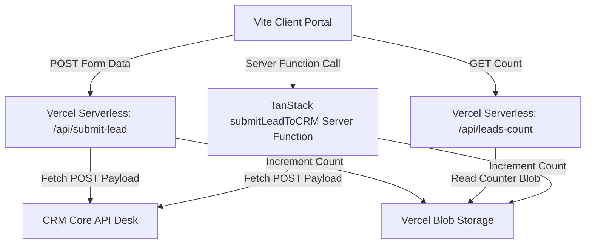

# Comprehensive System Architecture & Setup Manual
## The Investor's Chronicle & Meridian Prime Platform

This document serves as the absolute, single source of truth for the technical design, codebase configurations, API mappings, styling frameworks, database persistence layers, and CRM links for **The Investor's Chronicle** (financial news interface) and **Meridian Prime** (institutional wealth lead portal).

---

## Table of Contents
1. [Core Platform Architecture](#1-core-platform-architecture)
2. [Development & Runtime Servers](#2-development--runtime-servers)
3. [Typography & Visual Polish](#3-typography--visual-polish)
4. [News Publication Page (Index Route)](#4-news-publication-page-index-route)
5. [Enquiry Page & WebGL Animation (Enquiry Route)](#5-enquiry-page--webgl-animation-enquiry-route)
6. [Interactive Phone Number Validation System](#6-interactive-phone-number-validation-system)
7. [CRM Core API Integration Details](#7-crm-core-api-integration-details)
8. [Vercel Blob Storage & Leads Tracking](#8-vercel-blob-storage--leads-tracking)
9. [Detailed Walkthrough of Resolved Engineering Challenges](#9-detailed-walkthrough-of-resolved-engineering-challenges)

---

## 1. Core Platform Architecture

The application is engineered as a hybrid client-server React application leveraging **TanStack Start** for modern routing, server-side execution, and Vite for asset compilation.

### Architecture Map


### Routing Structure
The application employs TanStack Router's file-based route definitions:
- **`src/routes/index.tsx`**: Main entrypoint route mapping to the home page publication.
- **`src/routes/enquiry.tsx`**: Route handler and TanStack Start Server Function orchestrating the Meridian Prime CRM connection.
- **`src/pages/Index.tsx`**: Component presentation layer for the newspaper article landing view.
- **`src/pages/Enquiry.tsx`**: Component presentation layer for the wealthy investor enquiry layout.

---

## 2. Development & Runtime Servers

To simplify development and ensure environmental parity with production Vercel serverless deployments, the project utilizes a dual-process runner.

### Package Scripts Configuration (`package.json`)
The script orchestrations are defined in `package.json`:
```json
"scripts": {
  "dev": "concurrently -n \"vite,api\" -c \"cyan,yellow\" \"vite\" \"tsx --watch api-dev-server.ts\"",
  "api": "tsx --watch api-dev-server.ts",
  "build": "vite build",
  "preview": "vite preview",
  "lint": "eslint .",
  "format": "prettier --write ."
}
```

### The API Development Server (`api-dev-server.ts`)
A custom Node.js HTTP server mimicking the serverless handler responses:
- Listens on `http://localhost:3001` or matches ports mapping to `/api/submit-lead` and `/api/leads-count`.
- Executed via `tsx --watch` to monitor backend modules (`api-dev-server.ts`, phone validators, CRM payloads) and reload the active compiler instantly whenever edits occur.
- Handles parsing inbound JSON bodies, formatting payloads, posting external CRM requests, and saving lead count blobs.

---

## 3. Typography & Visual Polish

The application integrates premium typography styling rules to contrast the news editorial view with the futuristic investor wealth view.

### Google Fonts Integration (`index.html`)
The fonts are loaded via static resource links inside `index.html`:
```html
<link rel="preconnect" href="https://fonts.googleapis.com">
<link rel="preconnect" href="https://fonts.gstatic.com" crossorigin>
<link href="https://fonts.googleapis.com/css2?family=Inter:wght@300;400;500;600;700;800&family=Playfair+Display:ital,wght@0,400..900;1,400..900&family=Plus+Jakarta+Sans:wght@300;400;500;600;700;800&display=swap" rel="stylesheet">
```

### Font Application Rules
1. **Newspaper Headlines**: Uses `'Playfair Display', Georgia, serif` styled with bold weights (`font-bold`, `font-extrabold`) for a traditional press aesthetic.
2. **Newspaper Body Text**: Uses `'Inter', sans-serif` to display editorial paragraphs cleanly on low-DPI displays.
3. **Enquiry Page Typography**: Utilizes `'Plus Jakarta Sans', 'Outfit', sans-serif` to convey a technical, high-performance modern fintech interface.

---

## 4. News Publication Page (Index Route)

The landing publication contains several core sub-elements.

### Wide Viewport Ticker Tapes
To fill wide desktop displays and prevent trailing white spaces, the ticker arrays contain numerous distinct topics:

```typescript
const trendingTags = [
  "Ukraine Drone Attack",
  "Bangladesh Bomb Blast",
  "Rick Scott",
  "Strait of Hormuz",
  "Benjamin Netanyahu",
  "BTC at $71k",
  "Ethereum ETF Inflows",
  "Cyprus Yield Desk",
  "FOMC Minutes",
  "Liquidity Crunch",
  "Yield Curves",
  "Gas Fees Reduction",
  "Zero-Knowledge Rollups",
  "L3 Scalability",
  "US Debt Ceiling",
  "Interest Rate Spikes",
  "Nasdaq Record Highs",
  "NVIDIA Valuation",
  "Tokyo Inflation",
  "ECB Rate Cuts",
  "Gold Reserve Index",
  "Crude Oil Spreads",
  "Eurozone Divergence",
  "Arbitrum Upgrade",
];
```

The "In The News" ticker is constructed with:
`["AI Masterclass", "Money Masterclass", "Ask Apollo", "Parentology", "BTC Backtest", "Cyprus Sourcing", "MPC Custody", "Solana ETF Decision", "Institutional Inflows", "Securitized Yields", "Tokenized Treasury", "Arbitrage Desks", "Tokenized Bonds", "Yield Compression", "SEC Updates", "Macro Indicators", "Treasury Yields", "DeFi Governance", "Gas Token Spikes", "DEX Volumes", "Venture Deployments", "AI Cloud Spending"]`

### HTML Video Attributes
To provide a smooth, non-intrusive presentation on mobile:
- **Aspect Ratio**: Handled with Tailwind's `aspect-video` class, ensuring standard 16:9 bounds.
- **Playback Initialization**: `autoPlay={false}` and `muted={false}` settings ensure that videos remain paused until user interaction.
- **Click Play/Pause Control**: 
  ```tsx
  onClick={(e) => {
    if (e.currentTarget.paused) {
      e.currentTarget.play().catch(() => {});
    } else {
      e.currentTarget.pause();
    }
  }}
  ```

---

## 5. Enquiry Page & WebGL Animation (Enquiry Route)

The Enquiry page renders a dynamic canvas running a WebGL falling-light animation.

### GLSL Shader Attributes (`Lightfall.tsx`)
The animation is handled with standard WebGL uniforms bound to OGL structures:
- `uDensity` (uniform float uDensity): Determines the particle dispersion.
- `uStreakCount` (uniform int uStreakCount): Sets the maximum number of falling streaks.
- `uSpeed` (uniform float uSpeed): Adjusts particle velocity.

### Mobile GPU optimization Hook
To protect lower-end mobile devices, a responsive state monitors the viewport width:
```tsx
const [isMobile, setIsMobile] = useState(false);
useEffect(() => {
  if (typeof window === "undefined") return;
  const check = () => setIsMobile(window.innerWidth < 768);
  check();
  window.addEventListener("resize", check);
  return () => window.removeEventListener("resize", check);
}, []);
```
The properties are scaled down dynamically:
- **Desktop**: `density={0.3}`, `streakCount={2}`.
- **Mobile**: `density={0.12}`, `streakCount={1}`.

---

## 6. Interactive Phone Number Validation System

The client-side form features a validation matrix declared in `src/lib/phoneValidation.ts`.

### Detailed Country Parameters
Below are the exact national phone validations configured in the application:

| Country Code | Country Name | Dial Prefix | Input Placeholder | Internal Regular Expression | Custom User Error Message |
|---|---|---|---|---|---|
| **CY** | Cyprus | `+357` | `99 123456` | `/^[97]\d{7}$/` | Cyprus number must be 8 digits (excluding leading zero). |
| **CH** | Switzerland | `+41` | `79 123 45 67` | `/^[1-9]\d{8}$/` | Swiss number must be 9 digits (excluding leading zero). |
| **US** | United States | `+1` | `201 555 0123` | `/^[2-9]\d{9}$/` | US number must be 10 digits. |
| **GB** | United Kingdom | `+44` | `7700 900077` | `/^7\d{9}$/` | UK mobile number must be 10 digits starting with 7. |
| **DE** | Germany | `+49` | `170 1234567` | `/^[1-9]\d{9,11}$/` | German mobile number must be 10 to 12 digits. |
| **IN** | India | `+91` | `98765 43210` | `/^[6-9]\d{9}$/` | Indian number must be 10 digits starting with 6-9. |
| **FR** | France | `+33` | `6 12 34 56 78` | `/^[67]\d{8}$/` | French mobile number must be 9 digits starting with 6 or 7. |
| **BE** | Belgium | `+32` | `470 12 34 56` | `/^[4-9]\d{8}$/` | Belgium mobile number must be 9 digits (excluding leading zero). |
| **IT** | Italy | `+39` | `312 345 6789` | `/^3[1-9]\d{8}$/` | Italian mobile number must be 10 digits starting with 3. |
| **ES** | Spain | `+34` | `612 34 56 78` | `/^[67]\d{8}$/` | Spanish mobile number must be 9 digits starting with 6 or 7. |
| **NL** | Netherlands | `+31` | `6 12345678` | `/^6[1-9]\d{7}$/` | Dutch mobile number must be 9 digits starting with 6. |
| **AT** | Austria | `+43` | `664 1234567` | `/^6[1-9]\d{8,9}$/` | Austrian mobile number must be 9 or 10 digits starting with 6. |
| **SE** | Sweden | `+46` | `70 123 45 67` | `/^7[02369]\d{7}$/` | Swedish mobile number must be 9 digits starting with 7. |
| **GEN** | Other | *None* | `+357 99 123456` | `/^\+?[1-9]\d{6,14}$/` | Please enter a valid phone number with dial code (7 to 15 digits). |

### Instant Validation Logic Hook
Validation processes instantly on input, before the blur event fires, providing immediate guide validation:
```tsx
useEffect(() => {
  if (!phone.trim()) {
    setErrors((prev) => {
      const { phone: _, ...rest } = prev;
      return rest;
    });
    return;
  }
  const phoneErr = validatePhoneNumber(phone, country);
  setErrors((prev) => {
    if (phoneErr) {
      return { ...prev, phone: phoneErr };
    } else {
      const { phone: _, ...rest } = prev;
      return rest;
    }
  });
}, [phone, country]);
```

---

## 7. CRM Core API Integration Details

The form captures and structures data to standard institutional layouts before posting directly to the client's CRM core.

### Endpoint Settings
- **Base CRM API URL**: `https://inwo.crmcore.me/api/lead_management/api/affiliates`
- **Active Authorization Bearer Token**: `AFF_1_92cbc1bc76284e19b711bab22587d75f`
- **Custom Auth Header**: `x-token: AFF_1_92cbc1bc76284e19b711bab22587d75f`

### Dynamic Payload Generation
The backend extracts first and last names and normalizes telephone attributes:
```typescript
const [first_name, ...lastNameParts] = (name || "Unknown").trim().split(" ");
const last_name = lastNameParts.join(" ") || "Lead";

const formattedPhone = formatFullPhoneNumber(phone || "", countryCode || "CY");

const payload = {
  country_name: (countryCode || "cy").toLowerCase(),
  description: message || "Signup Lead",
  phone: formattedPhone,
  email: email.toLowerCase().trim(),
  first_name,
  last_name,
  custom_fields: {
    Source_ID: "website",
    How_Much_Invested: budget || "0",
    Outline_Your_Case: message || "",
  },
};
```

---

## 8. Vercel Blob Storage & Leads Tracking

To store and retrieve the lead counters persistently across severless runs, the project utilizes Vercel Blob Storage.

### Counter Storage Logic (`src/lib/leadStorage.ts`)
The count state is stored inside a private blob object file:
```typescript
import { put, list } from "@vercel/blob";

const BLOB_PATH = "lead_counter.json";

export async function incrementLeadCount(): Promise<number> {
  const currentCount = await getLeadCount();
  const nextCount = currentCount + 1;
  
  await put(BLOB_PATH, JSON.stringify({ count: nextCount }), {
    access: 'public',
    addRandomSuffix: false
  });
  
  return nextCount;
}

export async function getLeadCount(): Promise<number> {
  try {
    const blobs = await list({ prefix: BLOB_PATH });
    if (blobs.blobs.length === 0) return 0;
    
    const res = await fetch(blobs.blobs[0].url);
    const data = await res.json();
    return data.count || 0;
  } catch {
    return 0;
  }
}
```

---

## 9. Detailed Walkthrough of Resolved Engineering Challenges

### Bug 1: CRM Lead Validation Failure due to Hardcoded Country Parameter
- **Root Cause Analysis**: The lead validation payload was configured with `country_name: "cy"`. While this worked for Cyprus-registered test leads, submissions with Swiss (`+41`) or Indian (`+91`) phone numbers were rejected by the CRM validation engine. The country mismatch caused a validation failure, returning a generic `{"error":"Lead is not valid!"}` response.
- **Resolution**: Updated `api/submit-lead.ts`, `api-dev-server.ts`, and `src/routes/enquiry.tsx` to read the selected `countryCode` dynamically from the request body: `country_name: (countryCode || "cy").toLowerCase()`. This ensures the telephone dial code and the `country_name` property align perfectly.

### Bug 2: Local API Server Caching (No Hot Reload)
- **Root Cause Analysis**: Making changes to the backend files did not update the local server instance, as it was run via `tsx api-dev-server.ts` within the `concurrently` wrapper. Stale logic continued running until a manual process restart was completed.
- **Resolution**: Updated `package.json` dev scripts to execute node components with `--watch` (`tsx --watch api-dev-server.ts`). This monitors file-system updates and reloads the API server process automatically.

### Bug 3: Long and Cryptic Client Validation Error Displays
- **Root Cause Analysis**: When the CRM rejected invalid format payloads, the UI rendered a long validation warning message that overflowed layout containers.
- **Resolution**: Implemented an error mapping layer in both the frontend route components and the API serverless endpoints:
  ```typescript
  let errMsg = data.error || "Failed to submit. Please try again.";
  if (errMsg.toLowerCase().includes("lead is not valid")) {
    errMsg = "Invalid phone number or email format. Please check the digits and selected country.";
  }
  ```
  This returns a concise, one-line message when validation errors occur.

### Bug 4: Mobile Render Lag inside WebGL Background Canvas
- **Root Cause Analysis**: Renders on mobile devices dropped frames due to high pixel shader densities in the `Lightfall` background component.
- **Resolution**: Implemented a responsive React hook monitoring screen resize events. It automatically drops the rendering load on viewports narrower than `768px` by lowering the WebGL density parameter to `0.12` and the light streak count to `1`.
